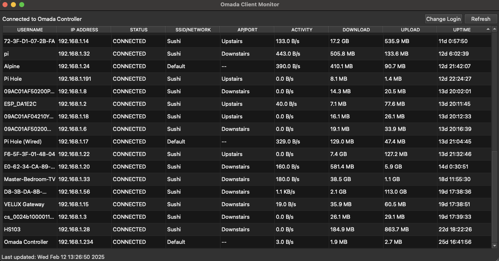

# Omada Client Monitor

The Omada interface doesn't allow for quick access to connected clients. You must navigate from the home screen _every time_ you want to see a newly connected client. This is annoying when trying to determine the IP of a newly connected IoT device. 

This desktop application refreses clients connected to an Omada Controller. It provides a graphical interface to view client details such as IP address, status, network name, and traffic statistics. Simply login with your controller creds, and all connected clients will be shown.

This UI shamelessly piggybacks off Gregory Haberek's fantastic https://github.com/ghaberek/omada-api





## Setup

### Prerequisites

Ensure you have the following installed:
- Python 3.6 or higher
- pip (Python package installer)

### Install Dependencies

1. Install the required Python packages:
    ```sh
    pip install -r requirements.txt
    ```

### Running the Application

1. Run the application using the following command:
    ```sh
    python omada_monitor.py
    ```

2. The application will attempt to auto-login using saved credentials. If no credentials are saved or auto-login fails, a login dialog will appear. You'll need to entire the base url (http://<ip_or_domain.tld>) and site (Usually `Default`).

The data will refresh every 30 seconds, or when "Refresh" is clicked.

### Saving Credentials

Creds are saved locally using Fernet encryption under ~/.omada-monitor Preferably, we'd store this in the Mac's keyring. Until then, you might want to use a read-only Omada controller user. To save your creds:

1. Enter your Omada Controller config in the login dialog.
2. Click the "Save and Login" button to securely save your credentials for future use in ~/.omada-monitor/credentials.enc

## Building (macos only)

I've opted to build this and pin it to my dock, so that I can locate newly connected clients with one click.

Create a Development macos App bundle which displays the process terminal along with the UI.

```
python setup.py py2app
```

Create a Production macos App bundle (you may need to remove dist, build, and .eggs first).

```
python setup.py py2app -A
```
