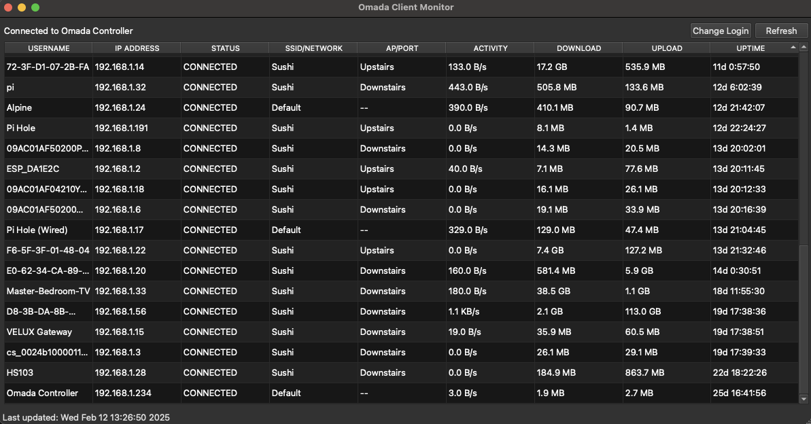

# Omada Client Monitor

_(See [releases](https://github.com/James9074/omada-monitor/releases/tag/1.0.0) for the macos .app download)_

The Omada interface doesn't allow for quick access to connected clients. You must navigate from the home screen _every time_ you want to see a newly connected client. This is annoying when trying to determine the IP of a newly connected IoT device.

This desktop application refreshes clients connected to an Omada Controller. It provides a graphical interface to view client details such as IP address, status, network name, and traffic statistics. Simply login with your controller creds, and all connected clients will be shown.

This UI shamelessly piggybacks off Gregory Haberek's fantastic https://github.com/ghaberek/omada-api





## Features

- Modern dark-themed client table, sortable by any column. Your sort, selection, and scroll position are preserved across refreshes.
- Live search/filter box to quickly find a device by name, IP, SSID, or AP.
- Right-click a row (or press ⌘C) to **copy a client's IP or MAC** to the clipboard.
- Configurable **refresh interval** (10s / 30s / 60s / 5m) and a connected-client count in the status bar.
- Network calls run off the UI thread, so the window stays responsive; the app silently re-logs-in if the controller session expires, and keeps showing the last-known clients if a refresh fails.
- Login dialog with inline field validation and helpful connection-error messages.
- Window size, sort, and refresh interval are remembered between launches.
- `--demo` mode renders the full UI with sample data — no controller required.


## Setup

### Prerequisites

Ensure you have the following installed:
- Python 3.9 or higher
- pip (Python package installer)

### Install Dependencies

1. Install the required Python packages:
    ```sh
    pip install -r requirements.txt
    ```

### Running the Application

1. Run the application using the following command:
    ```sh
    python omada_monitor.py
    ```

2. The application will attempt to auto-login using saved credentials. If no credentials are saved or auto-login fails, a login dialog will appear. You'll need to enter the base url (http://<ip_or_domain.tld>) and site (Usually `Default`).

The data refreshes automatically on the interval chosen in the header (default 30 seconds), or whenever "Refresh" is clicked.

### Demo Mode

To explore the interface with realistic sample data (no controller needed):

```sh
python omada_monitor.py --demo
```

(Or set `OMADA_DEMO=1`.)

### Saving Credentials

Creds are saved locally using Fernet encryption under `~/.omada-monitor` (files are written with `0600` permissions). Preferably, we'd store this in the Mac's keyring. Until then, you might want to use a read-only Omada controller user. Credentials are saved only after a successful login, in `~/.omada-monitor/credentials.enc`.

## Testing

Two suites cover the core logic and the Qt components:

```sh
python test_core_logic.py
python test_omada_monitor.py   # runs headless via QT_QPA_PLATFORM=offscreen
```

## Building (macos only)

I've opted to build this and pin it to my dock, so that I can locate newly connected clients with one click.

Create a Development macos App bundle which displays the process terminal along with the UI.

```
python setup.py py2app
```

Create a Production macos App bundle (you may need to remove dist, build, and .eggs first).

```
python setup.py py2app -A
```
